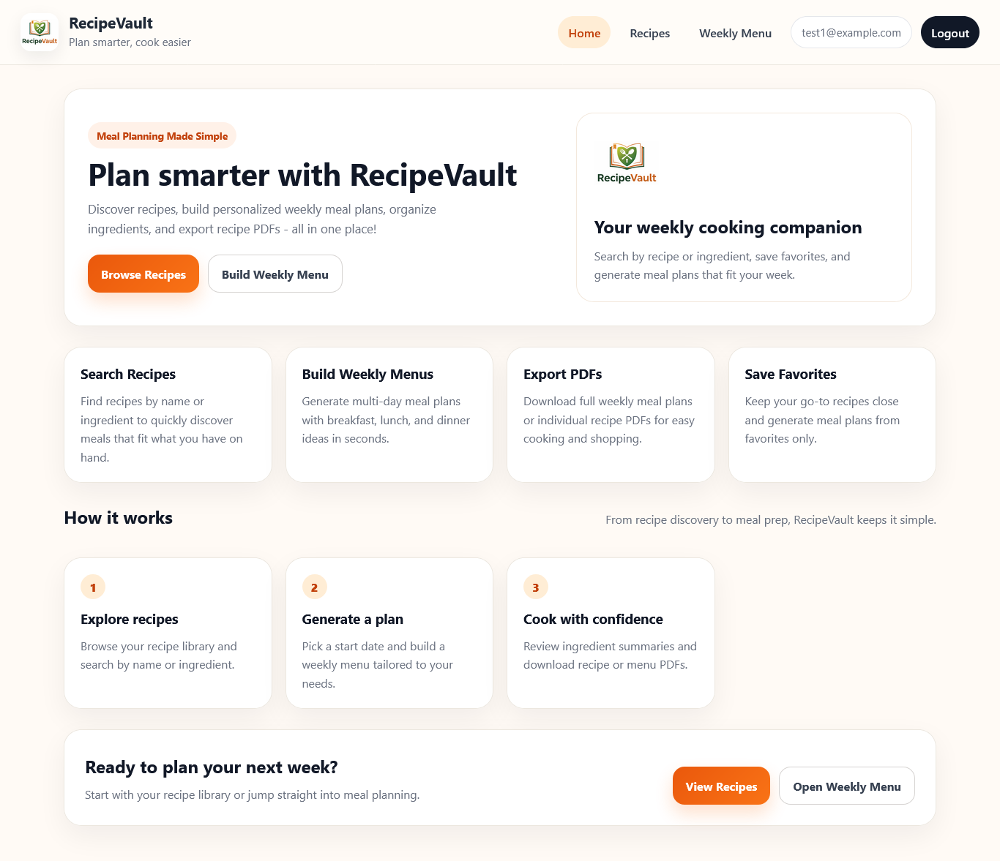
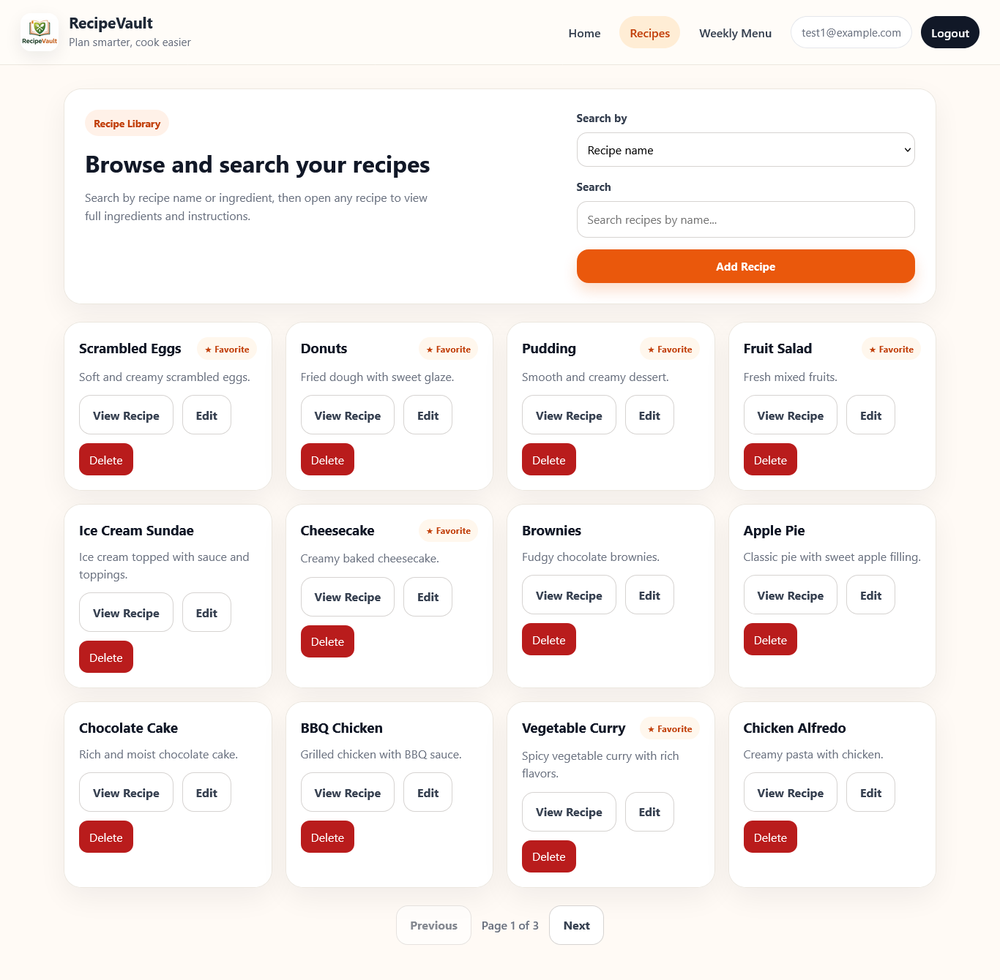
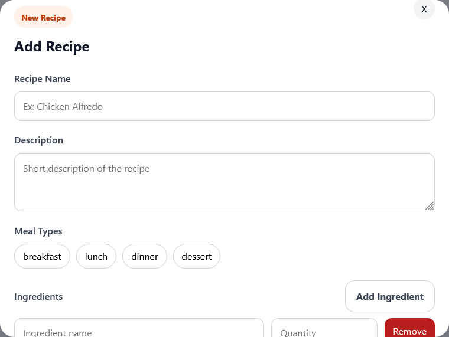
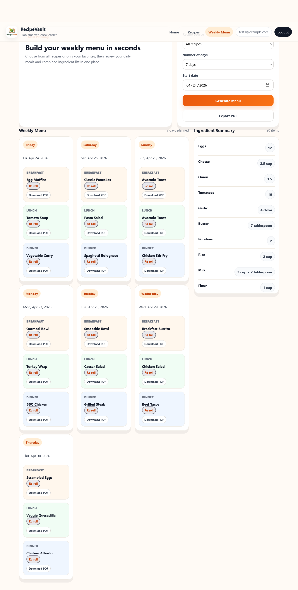

# RecipeVault

RecipeVault is a full-stack meal planning and recipe management application designed to simplify recipe organization, weekly meal planning, and grocery preparation.

Users can browse recipes, search by ingredient or recipe name, save favorites, generate multi-day meal plans, and view aggregated ingredient summaries for shopping preparation.

---

## Features

### Recipe Management

* Create, edit, and delete recipes
* Add and manage recipe ingredients
* Store recipe instructions and meal categories
* Associate recipes with breakfast, lunch, and dinner meal types

### Search & Discovery

* Search recipes by recipe name
* Search recipes by ingredient
* Retrieve random recipe suggestions

### Favorites System

* Save favorite recipes
* Generate meal plans using only favorited recipes

### Weekly Meal Planning

* Generate multi-day meal plans
* Automatically assign breakfast, lunch, and dinner meals
* Re-roll individual meals without regenerating the full menu
* Generate ingredient summaries across all meals

### Ingredient Aggregation

* Normalize ingredient quantities and units
* Combine repeated ingredients into grocery-style summaries

### User Authentication

* Register and log in users
* Protected routes for authenticated actions

---

## Tech Stack

### Frontend

* React
* TypeScript
* React Router
* CSS

### Backend

* Node.js
* Express
* TypeScript
* Prisma ORM

### Database

* PostgreSQL

### Validation & Utilities

* Zod
* bcrypt
* JWT authentication

---

## Screenshots

### Home Page

<p align="center">
  
</p>

The landing page introduces RecipeVault and provides quick access to recipe browsing and weekly meal planning.

---

### Recipes Page

<p align="center">
  
</p>

Browse recipes, search by name or ingredient, manage favorites, and access recipe management tools.

---

### Add Recipe Modal

<p align="center">
  
</p>

Create and edit recipes with ingredients, meal types, and cooking instructions.

---

### Weekly Menu Planner

<p align="center">
  
</p>

Generate multi-day meal plans, reroll meals dynamically, and review aggregated ingredient summaries for shopping preparation.

---

## Project Structure

```txt
frontend/
├── src/
│   ├── components/
│   ├── pages/
│   ├── api/
│   └── styles/

backend/
├── src/
│   ├── controllers/
│   ├── routes/
│   ├── middleware/
│   ├── validators/
│   └── config/
```

---

## Getting Started

### Prerequisites

* Node.js
* PostgreSQL
* npm

---

## Installation

### Clone the repository

```bash
git clone <your-repository-url>
cd recipe-vault
```

---

### Backend Setup

```bash
cd backend
npm install
```

Create a `.env` file:

```env
DATABASE_URL=your_database_url
JWT_SECRET=your_jwt_secret
PORT=3000
```

Run Prisma migrations:

```bash
npx prisma migrate dev
```

Start the backend server:

```bash
npm run dev
```

---

### Frontend Setup

```bash
cd frontend
npm install
```

Start the frontend:

```bash
npm run dev
```

---

## API Overview

### Recipes

```http
GET /recipes
POST /recipes
GET /recipes/:id
PATCH /recipes/:id
DELETE /recipes/:id
```

### Recipe Search

```http
GET /recipes/search?name=
GET /recipes/search-by-ingredient?name=
```

### Favorites

```http
POST /favorites/:recipeId
DELETE /favorites/:recipeId
GET /favorites
```

### Weekly Menu

```http
POST /weekly-menu/generate
POST /weekly-menu/reroll
```

---

## Example Recipe Payload

```json
{
  "name": "Chicken Soup",
  "description": "Simple homemade soup",
  "mealTypes": ["dinner"],
  "instructions": [
    "Boil broth",
    "Add chicken",
    "Simmer for 20 minutes"
  ]
}
```

---

## Key Technical Challenges

### Ingredient Normalization

Implemented quantity parsing and unit normalization logic to combine ingredient quantities across multiple recipes into aggregated shopping summaries.

### Relational Data Handling

Managed many-to-many relationships between recipes and ingredients using Prisma relational models.

### Dynamic Meal Planning

Built meal generation and reroll logic that dynamically rotates and reuses recipes when recipe counts are limited.

---

## Future Improvements

* Drag-and-drop meal planning
* Nutritional information support
* Recipe image uploads
* Shared meal plans
* Shopping list export improvements
* Automated grocery categorization

---

## Development Notes

This project was built using an iterative development process that combined hands-on debugging, refactoring, and AI-assisted development workflows to accelerate feature implementation while maintaining active involvement in architecture decisions, testing, and code validation.

---

## Author

Aaron Scroggins

GitHub: https://github.com/ScrogginsAaron

LinkedIn: https://linkedin.com/in/aaron-scroggins-a8b04a330
